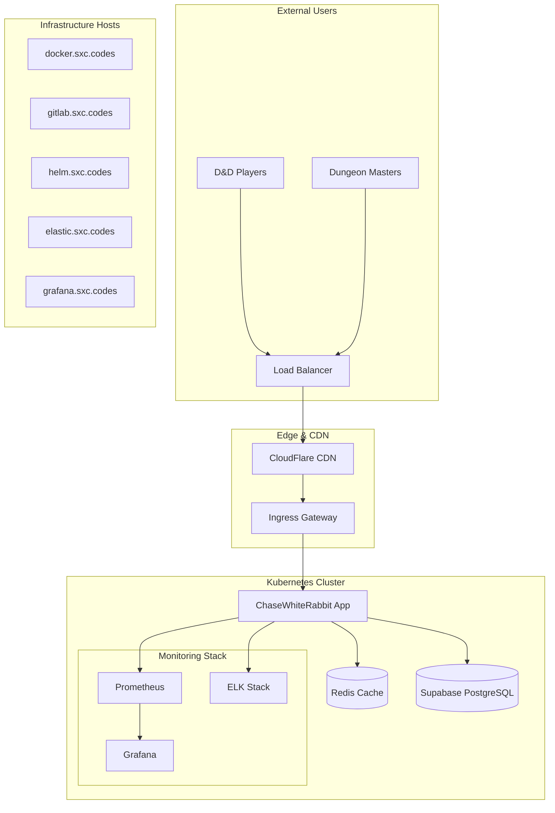
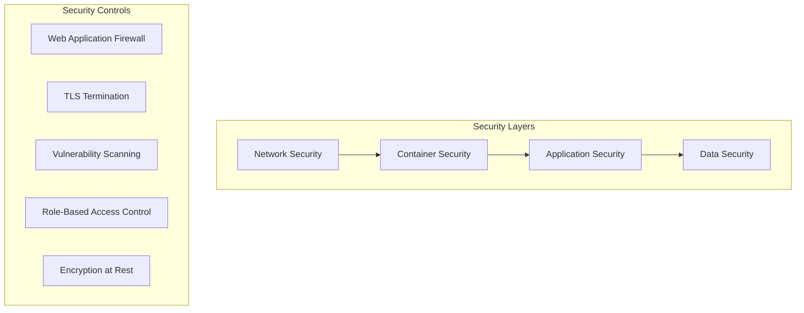
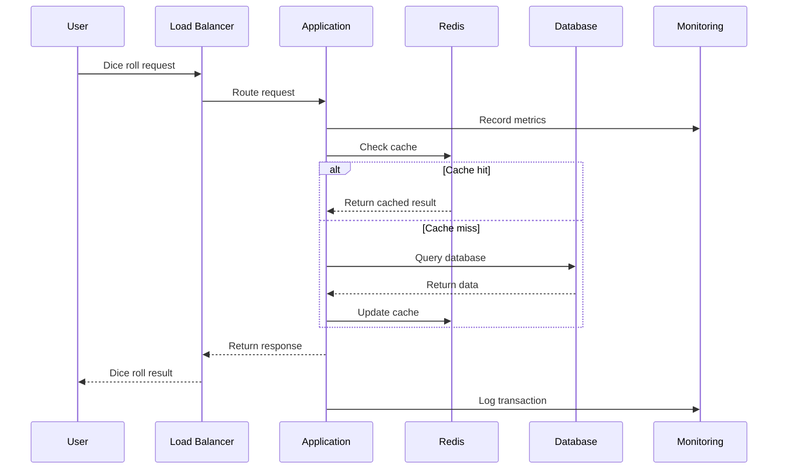

# ChaseWhiteRabbit Architecture Overview 🏗️

## Enterprise Architecture Philosophy

ChaseWhiteRabbit follows a **cloud-native, microservices-ready architecture** that balances enterprise-grade scalability with the simplicity that made DnDDiceRoller.com beloved by the gaming community.

## 🎯 Core Design Principles

### 1. **Respectful Modernization**
- **Legacy Preservation**: Maintain the lightning-fast response times (sub-100ms)
- **Dependency-Free Core**: Honor the original minimalist JavaScript approach
- **Progressive Enhancement**: Add enterprise features without compromising user experience

### 2. **Enterprise-Grade Reliability**
- **High Availability**: 99.9% uptime target with comprehensive monitoring
- **Observability First**: Metrics, logs, and traces for every component
- **Security by Design**: Automated vulnerability scanning and compliance

### 3. **Scalable Infrastructure**
- **Container Native**: Docker + Kubernetes for orchestration
- **Infrastructure as Code**: Terraform + Helm for reproducible deployments
- **Multi-Environment**: Development, staging, and production consistency

## 🏢 System Architecture

### High-Level Overview



### Component Architecture

#### 🎮 **Core Application Layer**
```
┌─────────────────────────────────────────────────────┐
│                Frontend (Vanilla JS)                │
├─────────────────────────────────────────────────────┤
│  • Lightning-fast dice rolling interface           │
│  • Minimal dependencies (honor original design)    │
│  • Progressive Web App capabilities               │
│  • Real-time updates via WebSockets               │
└─────────────────────────────────────────────────────┘

┌─────────────────────────────────────────────────────┐
│              API Gateway / Backend                  │
├─────────────────────────────────────────────────────┤
│  • RESTful API with OpenAPI specification         │
│  • Rate limiting and authentication               │
│  • Business logic and dice algorithms             │
│  • WebSocket support for real-time features       │
└─────────────────────────────────────────────────────┘
```

#### 🗄️ **Data Layer**
```
┌─────────────────┐  ┌─────────────────┐  ┌─────────────────┐
│   Redis Cache   │  │   Supabase      │  │   File Storage  │
│                 │  │   PostgreSQL    │  │                 │
│ • Session data  │  │ • User profiles │  │ • Static assets │
│ • Dice history  │  │ • Campaigns     │  │ • Backups       │
│ • Real-time     │  │ • Statistics    │  │ • Logs          │
│   state         │  │ • Audit trails  │  │                 │
└─────────────────┘  └─────────────────┘  └─────────────────┘
```

## 🚀 Infrastructure Components

### **Container Orchestration**
- **Docker**: Multi-stage builds for optimized images
- **Kubernetes**: Horizontal pod autoscaling and rolling deployments
- **Helm**: Chart-based deployment management

### **CI/CD Pipeline**
```
┌─────────┐  ┌─────────┐  ┌─────────┐  ┌─────────┐
│   Git   │→ │Security │→ │  Build  │→ │ Deploy  │
│ Commit  │  │  Scan   │  │ & Test  │  │ to K8s  │
└─────────┘  └─────────┘  └─────────┘  └─────────┘
     │             │            │            │
     │        ┌─────────┐  ┌─────────┐  ┌─────────┐
     │        │ Trivy   │  │ Jest    │  │ Helm    │
     │        │ Trufflehog│ │ K6      │  │ Charts  │
     │        └─────────┘  └─────────┘  └─────────┘
```

### **Monitoring & Observability**

#### **Metrics Collection (Prometheus)**
```yaml
Scrape Targets:
  - Application metrics (custom dice roll metrics)
  - Node exporter (system metrics)
  - Redis exporter (cache performance)
  - Kubernetes metrics (cluster health)
  - Infrastructure hosts (docker.sxc.codes, etc.)
```

#### **Visualization (Grafana)**
- **Business Dashboards**: Dice roll patterns, user engagement
- **Technical Dashboards**: Response times, error rates, resource usage
- **Infrastructure Dashboards**: Host health, container metrics

#### **Log Aggregation (ELK Stack)**
- **Elasticsearch**: Centralized log storage and indexing
- **Logstash**: Log processing and parsing
- **Kibana**: Log visualization and analysis

## 🔒 Security Architecture

### **Defense in Depth**



### **Security Implementation**
- **Network**: WAF, DDoS protection, TLS 1.3
- **Container**: Distroless images, non-root execution
- **Application**: OWASP compliance, input validation
- **Data**: Encryption at rest and in transit

## 📊 Scalability & Performance

### **Horizontal Scaling Strategy**
```yaml
Autoscaling Configuration:
  minReplicas: 2
  maxReplicas: 10
  targetCPU: 70%
  targetMemory: 80%
  
Performance Targets:
  Response Time: <100ms (99th percentile)
  Throughput: >1000 RPS
  Uptime: 99.9%
```

### **Caching Strategy**
1. **Browser Cache**: Static assets (CSS, JS, images)
2. **CDN Cache**: Global edge caching for content
3. **Application Cache**: Redis for session data and frequently accessed data
4. **Database Cache**: Supabase built-in query caching

## 🌍 Multi-Environment Strategy

### **Environment Progression**
```
Development (docker.sxc.codes)
    ↓
Staging (docker.tiation.net)
    ↓  
Production (chasewhiterabbit.sxc.codes)
```

### **Environment Configuration**
| Environment | Resources | Scaling | Monitoring | Deployment |
|-------------|-----------|---------|------------|------------|
| Development | 0.5 CPU, 512MB | Manual | Basic | Auto on push to `develop` |
| Staging | 1 CPU, 1GB | Limited (2-4 pods) | Full | Manual approval |
| Production | 2+ CPU, 2GB+ | Full autoscaling | Enhanced | Tagged releases only |

## 🔄 Data Flow Architecture

### **Request Lifecycle**


## 🎯 Migration Strategy

### **Legacy System Integration**
1. **Phase 1**: Infrastructure setup (Docker, K8s, monitoring)
2. **Phase 2**: Core application migration with feature parity
3. **Phase 3**: Enhanced features (user accounts, campaign tracking)
4. **Phase 4**: Advanced analytics and community features

### **Zero-Downtime Deployment**
- Blue-green deployments with traffic splitting
- Database migrations with backward compatibility
- Automated rollback on health check failures

## 📈 Future Scalability Considerations

### **Microservices Evolution**
```
Current Monolith
    ↓
Modular Monolith (Phase 2)
    ↓
Microservices (Phase 3)
    ↓
Event-Driven Architecture (Phase 4)
```

### **Technology Roadmap**
- **Near-term**: Enhanced monitoring, performance optimization
- **Medium-term**: Microservices decomposition, API v2
- **Long-term**: Machine learning for dice roll patterns, mobile apps

---

## 🔗 Related Documentation

- [Infrastructure Setup Guide](../infrastructure/README.md)
- [Development Environment](../development/README.md)
- [Monitoring & Observability](../monitoring/README.md)
- [Security Guidelines](../security/README.md)
- [API Documentation](../api/README.md)

---

*This architecture ensures ChaseWhiteRabbit can scale from thousands to millions of users while maintaining the simplicity and performance that D&D players love.*
